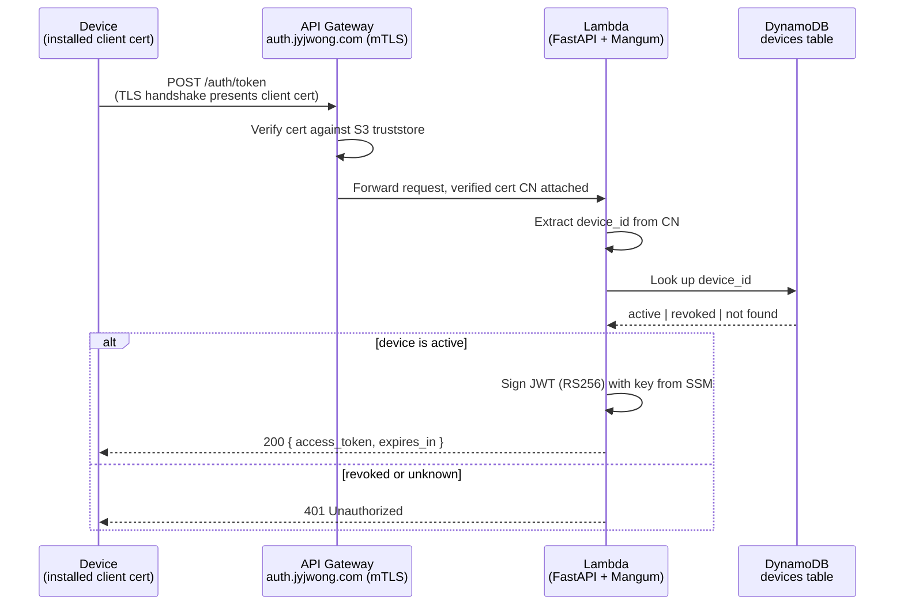
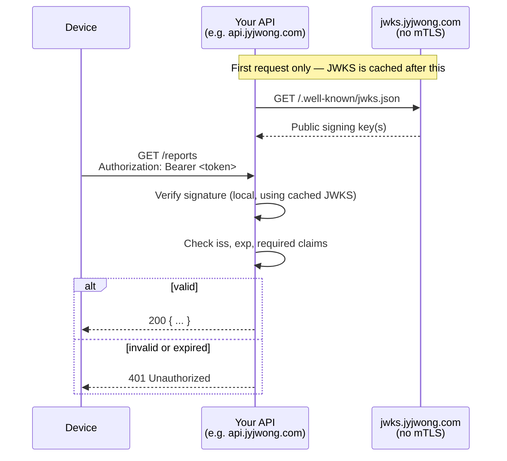

# How it works

There are two independent paths through Obsidian: **issuing** a token to a
trusted device, and **verifying** that token in one of your other services.
They never talk to each other directly — that's the whole point.

## 1. Issuing a token

The certificate check happens at **API Gateway**, before your application
code ever runs — an unrecognized certificate never reaches the Lambda. The
DynamoDB lookup is the one piece of *revocable* state in the whole flow: the
certificate alone only proves the device was provisioned once, not that
it's still trusted today.

## 2. Verifying a token

The device now holds a JWT and calls one of your other projects' APIs
directly — Obsidian is not in this path at all.

Two details matter here:

- **JWKS is served on a separate domain with no mTLS** (`jwks.jyjwong.com`,
  not `auth.jyjwong.com`). API Gateway enforces mTLS for *every* route under
  a custom domain, including `/.well-known/jwks.json` — a resource server
  with no device certificate of its own would get a TLS-level connection
  reset trying to fetch it from the issuer's domain.
- **Verification is entirely local.** `PyJWKClient` (or your language's
  equivalent) fetches the JWKS once and re-fetches only if it sees an
  unrecognized `kid` — there's no per-request network call to Obsidian.

See the **[API examples](examples/index.md)** for what this looks like in
actual code.

## Revocation

Because the trust decision (active vs. revoked) lives in DynamoDB rather
than in the certificate itself, revoking a device is instant and doesn't
require touching the CA:

- Mark the device revoked → its very next `/auth/token` request is refused.
- Any token issued *before* revocation keeps working until it naturally
  expires (default: one hour) — Obsidian issues short-lived tokens
  specifically so this window stays small.
- Device certificates also expire on their own (90 days by default), so a
  device you forget to revoke stops working regardless.
